# Laboratório: Funcionalidades Básicas do Apache Iceberg

## Introdução

Neste laboratório, você explorará as funcionalidades básicas do Apache Iceberg e aprenderá a criar e modificar tabelas do Iceberg com o Amazon Athena.

### O que é Apache Iceberg?

O Apache Iceberg é um formato de tabela aberto projetado para grandes conjuntos de dados analíticos. Ele oferece recursos avançados como:
- Operações ACID (Atomicidade, Consistência, Isolamento, Durabilidade)
- Evolução de esquema sem interrupção
- Consultas de viagem no tempo (time travel)
- Operações de linha única (inserir, atualizar, excluir)

Para mais informações, consulte a [documentação oficial do Apache Iceberg](https://iceberg.apache.org/) e o [guia do Amazon Athena para Iceberg](https://docs.aws.amazon.com/athena/latest/ug/querying-iceberg.html).

### Pré-requisitos

- Conta AWS ativa com permissões para Amazon Athena e S3
- Conhecimento básico de SQL
- ID da conta AWS (você pode obtê-lo executando `aws sts get-caller-identity --query Account --output text` no AWS CLI)

Observe que o Amazon Athena fornece suporte integrado para o Apache Iceberg, para que você possa ler e gravar em tabelas do Iceberg sem adicionar nenhuma dependência ou configuração adicional. Isso é válido para o [Tabelas Iceberg v2](https://iceberg.apache.org/spec/#version-2-row-level-deletes).


## Principais pontos de aprendizagem

---
* Criando tabelas Iceberg
* Atualizando um único registro
* Excluindo registros de uma tabela Iceberg (conformidade com [GDPR](https://gdpr-info.eu/))
* Evoluindo o esquema de uma tabela Iceberg

---

## Configurando o Athena

O Amazon Athena é um serviço de consulta interativo que facilita a análise de dados no Amazon S3 usando SQL padrão. Antes de começarmos a trabalhar com tabelas Iceberg, precisamos configurar o ambiente adequadamente.

**Importante**: Certifique-se de ter as permissões necessárias para acessar o Amazon Athena e criar recursos no S3. Para mais detalhes sobre permissões, consulte a [documentação de configuração do Athena](https://docs.aws.amazon.com/athena/latest/ug/getting-started.html).

1. Navegue até o [console do Amazon Athena](https://us-east-1.console.aws.amazon.com/athena/home?region=us-east-1#/landing-page) usando a barra de pesquisa.

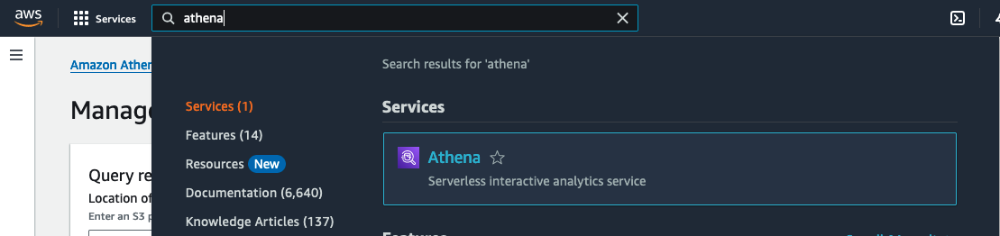

2. Selecione **Consultar seus dados com o Trino SQL** e depois **Iniciar editor de consultas**.

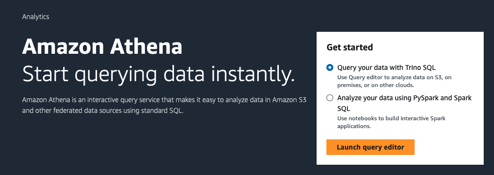

3. Quando estiver dentro do Amazon Athena, clique em **Editar configurações**.

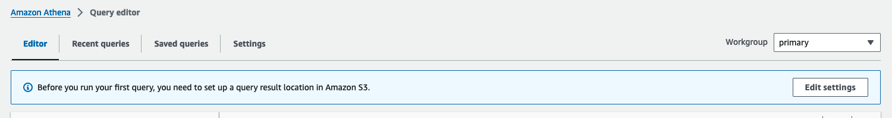

4. Configure `s3://otfs-workshop-data-<your-account-id>/athena_res/` como **Localização do resultado da consulta** e clique em **Salvar**. 

**Nota importante**: Substitua `<your-account-id>` pelo ID da sua conta AWS atual. Para encontrar seu Account ID, você pode:
- Executar `aws sts get-caller-identity --query Account --output text` no AWS CLI
- Verificar no canto superior direito do console AWS
- Usar o comando `SELECT current_user` no Athena

Isso garantirá que os resultados das consultas sejam armazenados em um local específico no Amazon S3, conforme recomendado nas [melhores práticas do Athena](https://docs.aws.amazon.com/athena/latest/ug/workgroups-settings.html).

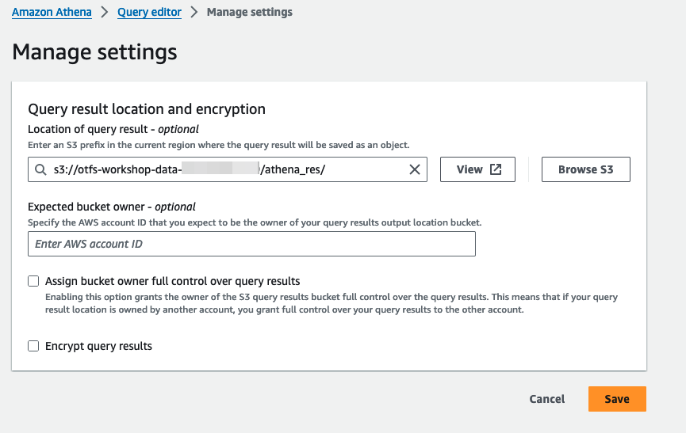

5. Selecione **Editor** para a página do editor de consultas.

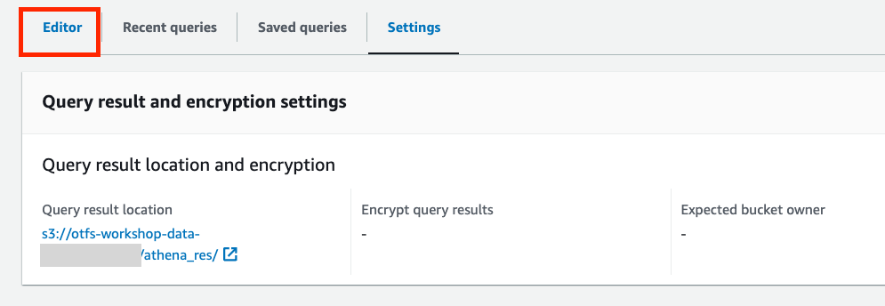

---

## Criando tabelas Iceberg

### Conceitos Fundamentais

Antes de criar nossa primeira tabela Iceberg, é importante entender alguns conceitos:

- **Database/Schema**: Organiza logicamente as tabelas relacionadas
- **Tabela Iceberg**: Formato de tabela que suporta operações ACID e evolução de esquema
- **Propriedades da tabela**: Configurações que definem comportamento e otimizações

As tabelas Iceberg oferecem vantagens significativas sobre formatos tradicionais, incluindo suporte nativo para operações de atualização e exclusão, conforme detalhado na [documentação oficial do Iceberg no AWS](https://docs.aws.amazon.com/prescriptive-guidance/latest/apache-iceberg-on-aws/iceberg-athena.html).

1. Para criar o Banco de Dados, copie a consulta abaixo no editor de consultas e clique em **Executar**. Você precisa estar no **Editor de Consultas** do Athena para executar os comandos abaixo.

``` sql
create database athena_iceberg_db;
```

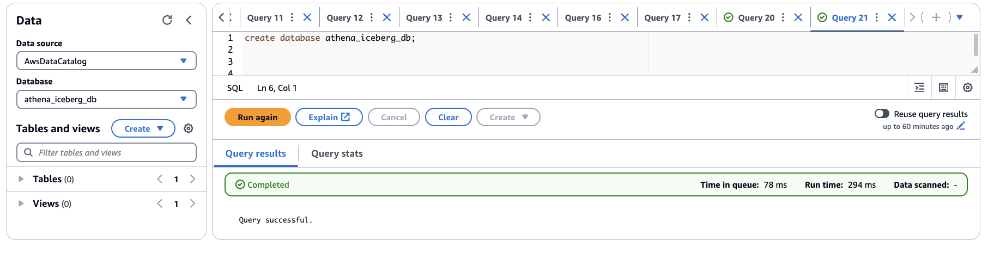

---


2. Para criar a tabela Iceberg, copie a consulta abaixo no editor de consultas, substitua `<your-account-id>` pelo ID da conta atual e clique em **Executar**.

**Explicação dos parâmetros da tabela**:
- `table_type='iceberg'`: Define o formato como Apache Iceberg
- `format='PARQUET'`: Usa Parquet para armazenamento eficiente
- `write_compression='zstd'`: Aplica compressão ZSTD para otimizar espaço e performance

Para mais detalhes sobre propriedades de tabelas Iceberg, consulte a [documentação de criação de tabelas no Athena](https://docs.aws.amazon.com/athena/latest/ug/querying-iceberg-creating-tables.html).

``` sql
CREATE TABLE athena_iceberg_db.customer_iceberg (
    c_customer_sk INT COMMENT 'unique id',
    c_customer_id STRING,
    c_first_name STRING,
    c_last_name STRING,
    c_email_address STRING)
LOCATION 's3://otfs-workshop-data-<your-account-id>/datasets/athena_iceberg/customer_iceberg'
TBLPROPERTIES (
  'table_type'='iceberg',
  'format'='PARQUET',
  'write_compression'='zstd'
);
```

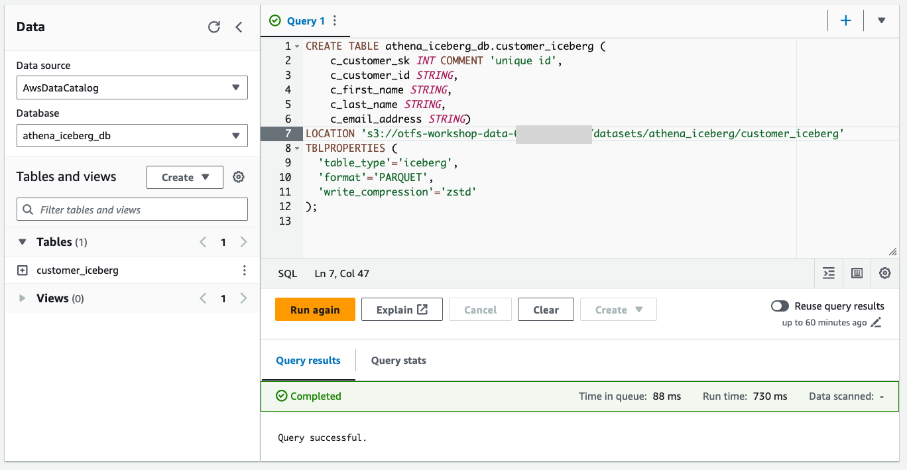

---

2. Você pode verificar se a nova tabela `customer_iceberg` foi criada no banco de dados. Não há dados na tabela no momento.

Você também pode selecionar o nome do banco de dados no menu suspenso no painel esquerdo para visualizar as tabelas dentro desse banco de dados.

``` sql
SHOW TABLES IN athena_iceberg_db;
```

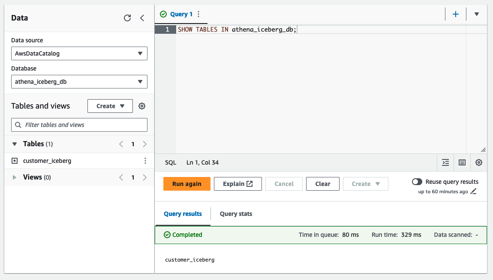

---

3. Você pode verificar o esquema e a definição de partição da tabela com a consulta DESCRIBE. Você também pode selecionar o nome da tabela no painel esquerdo para visualizar os detalhes da tabela.

``` sql
DESCRIBE customer_iceberg;
```

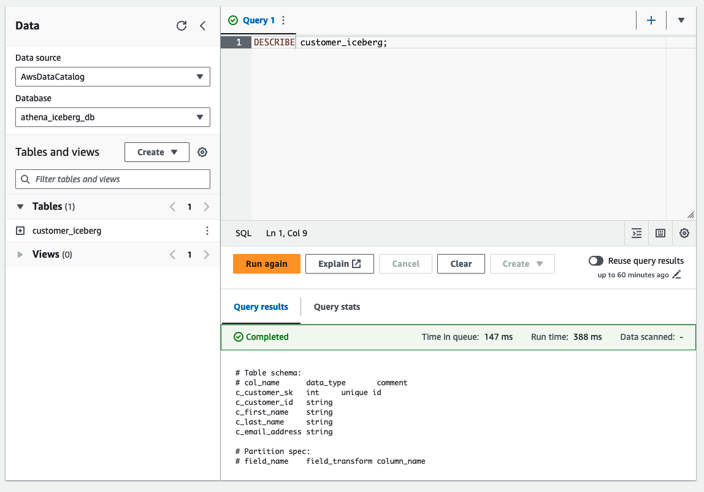

---

## Estrutura da tabela iceberg

### Arquitetura do Apache Iceberg

O Apache Iceberg utiliza uma arquitetura em camadas que garante consistência e performance. Compreender essa estrutura é fundamental para trabalhar efetivamente com o formato.

**Componentes principais**:
- **Snapshots**: Versões imutáveis da tabela em pontos específicos no tempo
- **Manifests**: Arquivos que listam os arquivos de dados e suas estatísticas
- **Metadata**: Informações sobre esquema, particionamento e histórico da tabela

Para uma explicação detalhada da arquitetura, consulte a [especificação oficial do Apache Iceberg](https://iceberg.apache.org/spec/) e o [guia de conceitos do Iceberg no AWS](https://docs.aws.amazon.com/prescriptive-guidance/latest/apache-iceberg-on-aws/iceberg-concepts.html).

Aqui está um diagrama representando a estrutura da tabela subjacente do Iceberg:

* Cada operação de confirmação (inserir, atualizar, excluir, mesclar, compactar) no Iceberg gera um novo Snapshot (por exemplo, S0, S1, ...).
* Cada operação (confirmação, atualização de esquema, roll\-back, roll\-forward) no Iceberg gera um novo arquivo de metadados.
* A tabela de catálogo do Iceberg aponta para o arquivo de metadados mais recente (ponteiro de metadados atual).
* O arquivo de metadados, entre outras informações, contém a lista de snapshots disponíveis e o ID do snapshot atual.
* Cada snapshot de tabela é associado a um arquivo de lista de manifesto.
* Cada arquivo de lista de manifesto, entre outras informações, aponta para um ou muitos arquivos de manifesto.
* Cada arquivo de manifesto aponta para um ou muitos arquivos de dados.

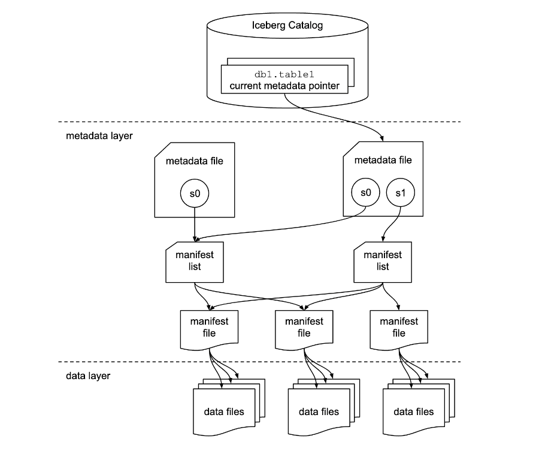

As tabelas Athena Iceberg expõem vários metadados de tabela, como arquivos de tabela, manifestos, histórico, partição, snapshot por meio de tabelas de metadados. Nós os consultaremos em momentos diferentes como parte deste exercicio.

**Tabelas de metadados disponíveis**:
- `$files`: Lista todos os arquivos de dados da tabela
- `$manifests`: Mostra informações sobre arquivos de manifesto
- `$snapshots`: Histórico de snapshots da tabela
- `$history`: Cronologia de operações realizadas

Para mais informações sobre tabelas de metadados, consulte a [documentação de metadados do Iceberg](https://docs.aws.amazon.com/athena/latest/ug/querying-iceberg-table-data.html#querying-iceberg-table-metadata).

4. Você pode executar uma consulta `SELECT` usando a sintaxe `<table_name>$files` para consultar os metadados da tabela `files` do Iceberg. A tabela `customer` não contém nenhum dado no momento. Então, ela não mostrará nenhum arquivo.

``` sql
SELECT * FROM "athena_iceberg_db"."customer_iceberg$files"
```

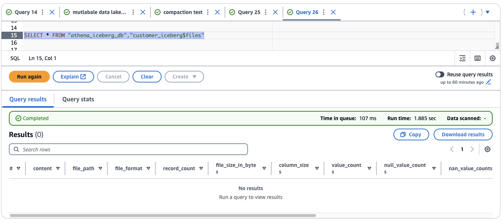

* Você pode executar uma consulta `SELECT` usando a sintaxe `<table_name>$manifests` para consultar os metadados da tabela `manifests` do Iceberg. A consulta abaixo não mostrará dados, pois a tabela está vazia.

``` sql
SELECT * FROM "athena_iceberg_db"."customer_iceberg$manifests"
```

* Você pode executar uma consulta `SELECT` usando a sintaxe `<table_name>$snapshots` para consultar os metadados da tabela `$snapshots` do Iceberg. A consulta abaixo não mostrará dados, pois a tabela está vazia.

``` sql
SELECT * FROM "athena_iceberg_db"."customer_iceberg$snapshots"
```

---

5. Agora vamos pegar alguns registros da tabela `tpcds.prepared_customer` e inseri-los dentro da tabela `customer_iceberg`.

``` sql
INSERT INTO athena_iceberg_db.customer_iceberg
SELECT * FROM tpcds.prepared_customer 
```

Você deverá ver a mensagem "Consulta bem-sucedida" nos resultados da consulta.

---

6. Verifique se os dados estão carregados corretamente consultando a tabela. Copie a consulta abaixo no editor de consultas e clique em **Executar**

``` sql
select * from athena_iceberg_db.customer_iceberg limit 10;
```

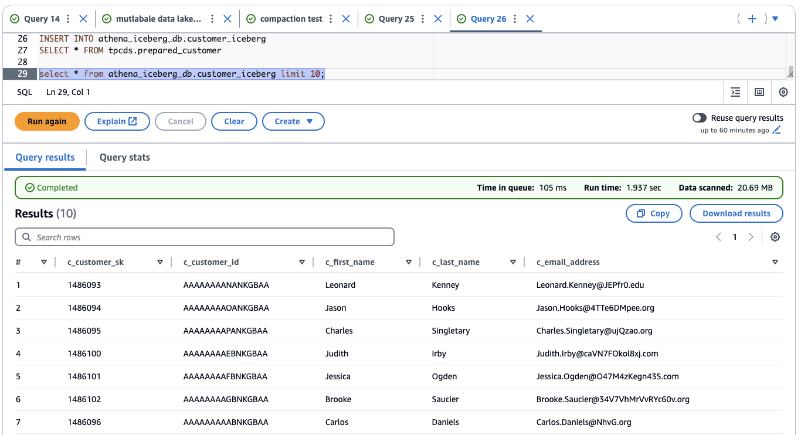


7. Verifique se o comando insert inseriu 2.000.000 de registros de clientes na tabela.

``` sql
select count(*) from athena_iceberg_db.customer_iceberg;
```

Você deve ver `20000 'nos resultados da consulta.


8. Dentro do local da tabela do [Amazon S3](https://us-east-1.console.aws.amazon.com/s3/home?region=us-east-1): `s3://otfs-workshop-data-<your-account-id>/datasets/athena_iceberg/customer_iceberg/` (`<your-account-id>` é o ID da sua conta atual), você verá duas pastas, **data** e **metadata**. A pasta **data** contém os dados reais no formato parquet e a pasta **metadata** contém vários arquivos de metadados.
Existem três tipos de arquivos de metadados:

* arquivo de metadados, terminando com `.metadata.json`
* lista de manifesto, terminando com `*-m*.avro`
* arquivos de manifesto, no formato de `snap-*.avro`

Um novo arquivo de metadados será criado sempre que você fizer alterações na tabela.

Pasta de metadados:

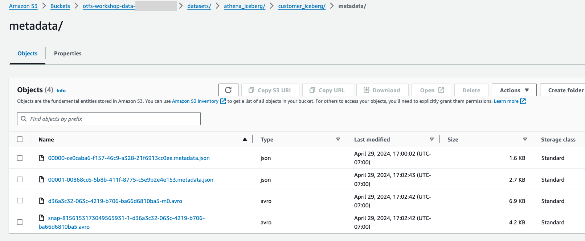

Pasta de dados:

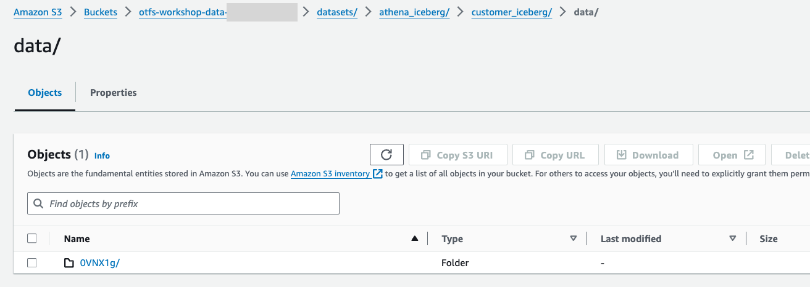

Agora vamos consultar os metadados da tabela Iceberg.

* Execute a seguinte instrução para listar os arquivos da tabela Iceberg.

``` sql
SELECT * FROM "athena_iceberg_db"."customer_iceberg$files"
```

Nos resultados da consulta, você verá detalhes sobre o caminho dos arquivos de dados do S3 na coluna `file_path` (extensão `.parquet`).

* Execute a seguinte instrução para listar os manifestos da tabela Iceberg.

``` sql
SELECT * FROM "athena_iceberg_db"."customer_iceberg$manifests"
```

Nos resultados da consulta, você verá detalhes sobre o caminho dos arquivos de manifesto do S3 na coluna `path` (extensão `.avro`).

* Execute a seguinte instrução para ver o histórico de ações da tabela Iceberg.

``` sql
SELECT * FROM "athena_iceberg_db"."customer_iceberg$history"
```

Nos resultados da consulta, você verá `snapshot_id`, `parent_id`, etc.


* Execute a seguinte instrução para ver os detalhes do instantâneo da tabela Iceberg.

``` sql
SELECT * FROM "athena_iceberg_db"."customer_iceberg$snapshots"
```

Nos resultados da consulta, você verá `snapshot_id`, `parent_id`, `manifest_list`, etc.

---

**Parabéns, você criou uma tabela Iceberg! Agora vamos explorar alguns dos principais recursos do Athena Iceberg.**

---

## Atualizar registros

### Operações DML no Apache Iceberg

Uma das principais vantagens do Apache Iceberg é o suporte nativo para operações DML (Data Manipulation Language) como UPDATE e DELETE. Isso é uma evolução significativa em relação aos formatos tradicionais de data lake que requeriam reescrita completa de partições.

**Como funciona o UPDATE no Iceberg**:
- Utiliza a abordagem "merge-on-read" para eficiência
- Cria arquivos de exclusão (delete files) para marcar registros antigos
- Adiciona novos registros com os dados atualizados
- Mantém consistência ACID durante toda a operação

Para detalhes técnicos sobre operações DML, consulte a [documentação de operações de escrita do Iceberg](https://docs.aws.amazon.com/prescriptive-guidance/latest/apache-iceberg-on-aws/best-practices-write.html).

Sua próxima tarefa é fazer uma limpeza de dados. Na seção a seguir, você se concentrará em um cliente específico que inseriu seu sobrenome e e-mail incorretamente. Como resultado, esses dois campos são `Null` e você tem a tarefa de corrigi-los.

9. Copie a consulta abaixo no editor de consultas e clique em **Executar**.

``` sql
select * from athena_iceberg_db.customer_iceberg
WHERE c_customer_sk = 15
```

Observe que o sobrenome (`c_last_name`) e o endereço de e-mail (`c_email_address`) do usuário Tonya são `null`. Sua equipe de atendimento ao cliente coletou o sobrenome e o e-mail dele e os forneceu a você.

10. Você pode facilmente fazer essa alteração usando a consulta `UPDATE`. Consultas `UPDATE` aceitam um filtro para corresponder linhas a serem atualizadas. Copie a consulta abaixo no editor de consultas e clique em **Executar**.

``` sql
UPDATE athena_iceberg_db.customer_iceberg
SET c_last_name = 'John', c_email_address = 'johnTonya@abx.com' 
WHERE c_customer_sk = 15
```

A consulta deverá ser executada com sucesso e você verá a mensagem "Consulta bem-sucedida" nos resultados da consulta.

11. Verifique se o sobrenome e o endereço de e-mail de Tonya estão fixos. Copie a consulta abaixo no editor de consultas e clique em **Executar**.

``` sql
select * from athena_iceberg_db.customer_iceberg
WHERE c_customer_sk = 15
```

Observe que o sobrenome e o endereço de e-mail de Tonya foram atualizados agora.

Athena usa [merge-on-read](https://docs.aws.amazon.com/pt_br/prescriptive-guidance/latest/apache-iceberg-on-aws/best-practices-write.html) para operações UPDATE.

**Entendendo Merge-on-Read vs Copy-on-Write**:

- **Merge-on-Read**: Estratégia mais eficiente que cria arquivos de exclusão e novos dados sem reescrever arquivos existentes
- **Copy-on-Write**: Reescreve arquivos inteiros, mais custoso em termos de I/O

**Como funciona na prática**:
Isso significa que ele grava arquivos de exclusão de posição Iceberg e linhas recém-atualizadas como arquivos de dados na mesma transação.
Arquivos de exclusão baseados em posição identificam linhas excluídas por arquivo e posição em um ou mais arquivos de dados.
Em contraste com uma atualização **copy-on-write**, uma atualização merge-on-read é mais eficiente porque não reescreve arquivos de dados inteiros.
Quando lemos uma tabela Iceberg configurada com atualizações **merge-on-read**, o mecanismo mescla os arquivos de exclusão de posição Iceberg com arquivos de dados para produzir a visualização mais recente de uma tabela.
Uma operação UPDATE no Iceberg pode ser imaginada como uma combinação de INSERT INTO e DELETE.

Para mais detalhes sobre estratégias de escrita, consulte a [documentação de melhores práticas do Iceberg](https://docs.aws.amazon.com/prescriptive-guidance/latest/apache-iceberg-on-aws/best-practices-write.html).

13. Você pode verificar como essa operação UPDATE impacta a camada de dados do Iceberg. Observe que há um novo arquivo parquet criado devido à alteração acima. Você pode identificar esse novo arquivo verificando o timestamp do arquivo `LastModified` inspecionando na pasta **data** da tabela S3.

A declaração a seguir lista os arquivos para uma tabela Iceberg.

``` sql
SELECT * FROM "athena_iceberg_db"."customer_iceberg$files"
```

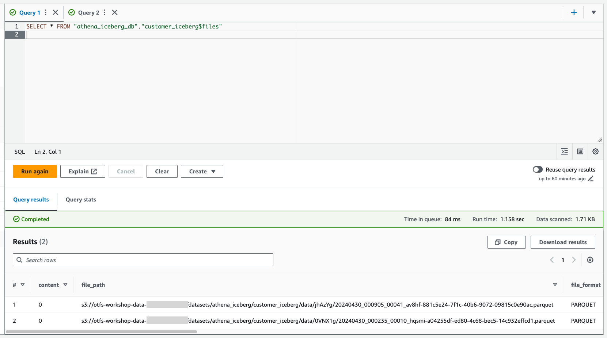

---

## Delete rows from Iceberg table

### Operações de Exclusão e Conformidade GDPR

O Apache Iceberg oferece suporte robusto para operações de exclusão, essencial para conformidade com regulamentações como GDPR (General Data Protection Regulation). A capacidade de excluir registros específicos sem reescrever partições inteiras é uma vantagem significativa.

**Importância da exclusão de dados**:
- **Conformidade GDPR**: Direito ao esquecimento (Right to be Forgotten)
- **Limpeza de dados**: Remoção de registros inválidos ou duplicados
- **Manutenção**: Exclusão de dados antigos conforme políticas de retenção

Para mais informações sobre conformidade GDPR e exclusão de dados, consulte a [documentação de operações DML do Athena](https://docs.aws.amazon.com/athena/latest/ug/language-reference.html).

Tonya escolheu optar por sair do aplicativo com base em seus direitos GDPR. Agora você precisa excluir seus registros.

Você pode fazer essa alteração facilmente usando a consulta `DELETE FROM`. As consultas `DELETE FROM` aceitam um filtro para corresponder às linhas a serem excluídas.

**Funcionamento técnico do DELETE**:


Athena usa `merge-on-read` para operações DELETE.
Isso significa que ele cria arquivos de exclusão baseados em Position ao executar instruções DELETE.
Arquivos de exclusão baseados em Position identificam linhas excluídas por arquivo e posição em um ou mais arquivos de dados.
Em contraste com uma exclusão **copy-on-write**, uma exclusão merge-on-read é mais eficiente porque não reescreve arquivos de dados inteiros.
Quando lemos uma tabela Iceberg configurada com exclusões **merge-on-read**, o mecanismo mescla os arquivos de exclusão de posição Iceberg com arquivos de dados para produzir a visualização mais recente de uma tabela.

12. Copie a consulta abaixo no editor de consultas e clique em **Executar**.

``` sql
delete from athena_iceberg_db.customer_iceberg
WHERE c_customer_sk = 15
```

A consulta deverá ser executada com sucesso e você verá a mensagem "Consulta bem-sucedida" nos resultados da consulta.


13. Verifique se o registro de Tonya foi removido da tabela Iceberg.

``` sql
SELECT * FROM athena_iceberg_db.customer_iceberg WHERE c_customer_sk = 15
```

Você deverá ver "Nenhum resultado" nos resultados da consulta.

---

## Time Travel

### Consultas de Viagem no Tempo

O Time Travel é uma das funcionalidades mais poderosas do Apache Iceberg, permitindo consultar dados como eles existiam em pontos específicos no tempo. Isso é fundamental para:

- **Auditoria**: Rastrear mudanças nos dados ao longo do tempo
- **Recuperação**: Acessar versões anteriores em caso de erros
- **Análise temporal**: Comparar estados diferentes dos dados
- **Debugging**: Investigar quando e como os dados foram alterados

**Conceitos importantes**:
- **Snapshot**: Versão imutável da tabela em um momento específico
- **Snapshot ID**: Identificador único de cada versão
- **Timestamp**: Momento exato da criação do snapshot

Para mais detalhes sobre Time Travel, consulte a [documentação de consultas temporais do Iceberg](https://docs.aws.amazon.com/athena/latest/ug/querying-iceberg-table-data.html#querying-iceberg-time-travel).

O Time-travel permite consultas reproduzíveis apontando para um instantâneo de tabela específico e permite que os usuários examinem facilmente as alterações.

Cada alteração em uma tabela Iceberg cria uma versão independente da árvore de metadados, chamada snapshot. Você verá 3 snapshots no total usando a seguinte consulta.

**Tipos de operações que criam snapshots**:
* operação de inserção inicial (append) - Adiciona novos dados à tabela
* operação de atualização (overwrite) - Modifica registros existentes
* operação de exclusão (delete) - Remove registros da tabela

**Interpretando os resultados**:
Observe que a consulta abaixo está direcionada a uma tabela de metadados de histórico que mantém o registro cronológico de todas as operações realizadas na tabela.

14. Para consultar o histórico da tabela, copie a consulta abaixo no editor de consultas e clique em **Executar**.

``` sql
SELECT * FROM "athena_iceberg_db"."customer_iceberg$history"
order by made_current_at;
```

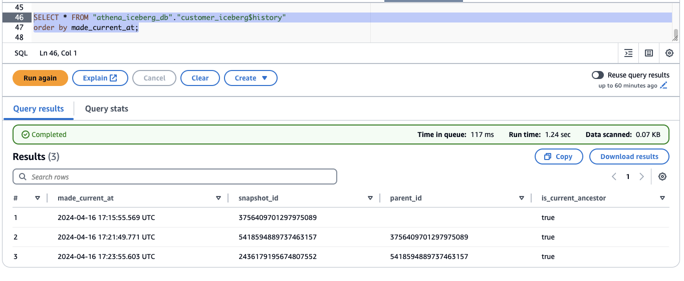

* Linha 1 corresponde à operação de inserção inicial que realizamos para preencher a tabela. A coluna `snapshot_id` mostra o primeiro snapshot criado.
* Linha 2 corresponde à operação de atualização que realizamos. A coluna `snapshot_id` mostra o segundo snapshot criado.
* Linha 3 corresponde à operação de exclusão que realizamos. A coluna `snapshot_id` mostra o terceiro (mais recente) snapshot criado.

15. Substitua `5418594889737463157` pelo `snapshot_id` da Linha 2 para consultar o estado da tabela correspondente ao segundo snapshot (antes da operação de exclusão ser executada).

``` sql
select * from athena_iceberg_db.customer_iceberg
FOR VERSION AS OF  5418594889737463157
WHERE c_customer_sk = 15
```

No resultado da consulta, você deve ver o registro do cliente Tonya.

16. Como alternativa, podemos usar a coluna `made_current_at` para consultar um instantâneo específico.

**Métodos de Time Travel**:
- **FOR VERSION AS OF**: Usa o snapshot_id específico
- **FOR TIMESTAMP AS OF**: Usa um timestamp específico (mais intuitivo)

**Dica prática**: O método por timestamp é geralmente mais fácil de usar em cenários reais, pois você pode especificar "como os dados estavam às 14:30 de ontem" sem precisar conhecer o snapshot_id específico.

Copie a consulta abaixo no editor de consultas, substitua `2024-03-03 07:45:10.651 UTC` na consulta pelo valor `made_current_at` da Linha 2 (ponto 15) e clique em **Executar**.

``` sql
select * from athena_iceberg_db.customer_iceberg
FOR TIMESTAMP AS OF TIMESTAMP '2024-04-16 17:21:49.771 UTC'
WHERE c_customer_sk = 15
```

No resultado da consulta, você deve ver o registro do cliente Tonya.

---

## Evolução do esquema

### Schema Evolution - Adaptação sem Interrupção

A evolução de esquema é uma das características mais valiosas do Apache Iceberg, permitindo modificar a estrutura da tabela sem interromper aplicações existentes ou reescrever dados.

**Vantagens da evolução de esquema**:
- **Operações apenas de metadados**: Mudanças de esquema não alteram arquivos de dados
- **Compatibilidade**: Aplicações antigas continuam funcionando
- **Flexibilidade**: Adapta-se a mudanças nos requisitos de negócio
- **Performance**: Sem necessidade de reprocessar dados existentes

**Casos de uso comuns**:
- Adicionar colunas para novos requisitos
- Renomear colunas para melhor clareza
- Alterar tipos de dados (com promoções seguras)
- Reorganizar estrutura da tabela

Para detalhes completos sobre evolução de esquema, consulte a [documentação oficial do Iceberg sobre schema evolution](https://iceberg.apache.org/docs/latest/evolution/) e o [guia do Athena para DDL](https://docs.aws.amazon.com/athena/latest/ug/querying-iceberg-managing-tables.html).

As atualizações do esquema Iceberg são alterações somente de metadados. Nenhum arquivo de dados é alterado quando você executa uma atualização de esquema. O formato Iceberg suporta as seguintes alterações de evolução de esquema:


* Adicionar – Adiciona uma nova coluna a uma tabela ou a uma struct aninhada.
* Soltar – Remove uma coluna existente de uma tabela ou struct aninhada.
* Renomear – Renomeia uma coluna ou campo existente em uma struct aninhada.
* Reordenar – Altera a ordem das colunas.
* Promoção de tipo – Amplia o tipo de uma coluna, campo de struct, chave de mapa, valor de mapa ou elemento de lista. Atualmente, os seguintes casos são suportados para tabelas Iceberg:
  + inteiro para inteiro grande
  + flutuante para duplo
  + aumentando a precisão de um tipo decimal

**Demonstração prática**: Vamos demonstrar como essas operações funcionam na prática, começando pela verificação dos arquivos existentes e depois realizando mudanças de esquema.

17. Vamos consultar os arquivos de dados.

``` sql
SELECT * FROM "athena_iceberg_db"."customer_iceberg$files"
```

Anote o caminho e o nome do arquivo de dados.

18. Agora altere o nome de uma coluna. Você pode usar o seguinte comando DDL para alterar o nome da coluna `c_email_address` para `email`.

**Importante**: Esta operação demonstra como o Iceberg permite mudanças de esquema sem impacto nos dados subjacentes. O comando ALTER TABLE modifica apenas os metadados da tabela.

``` sql
ALTER TABLE athena_iceberg_db.customer_iceberg 
change column c_email_address email STRING
```

A consulta deve ser executada sem nenhum erro.

19. Vamos consultar os arquivos de dados novamente para verificar se eles não foram alterados.

``` sql
SELECT * FROM "athena_iceberg_db"."customer_iceberg$files"
```

Observe que não há nenhum novo arquivo de dados criado devido à evolução do esquema. As alterações do esquema são armazenadas na camada de metadados.

Verifique se a coluna foi renomeada executando a consulta `DESCRIBE customer_iceberg;`.

20. Use o seguinte comando DDL para adicionar uma nova coluna chamada `c_birth_date`.

**Comportamento de novas colunas**: Quando você adiciona uma nova coluna a uma tabela Iceberg existente, todos os registros já presentes terão valor `null` para essa coluna. Novos registros inseridos podem ter valores específicos para a nova coluna.

``` sql
ALTER TABLE athena_iceberg_db.customer_iceberg ADD COLUMNS (c_birth_date int)
```
Verifique se a nova coluna foi adicionada executando a consulta `DESCRIBE customer_iceberg;`.


21. Execute a consulta a seguir para ver a tabela com a nova coluna. Observe que a nova coluna tem valores `null` para todos os registros atualmente presentes dentro da tabela.

**Conclusão do laboratório**: Parabéns! Você completou com sucesso o laboratório de funcionalidades básicas do Apache Iceberg. Você aprendeu sobre:

- Criação e configuração de tabelas Iceberg
- Operações DML (INSERT, UPDATE, DELETE)
- Consultas de Time Travel
- Evolução de esquema sem interrupção
- Estrutura e metadados do Iceberg

**Próximos passos**: Estes conceitos fundamentais preparam você para explorar funcionalidades mais avançadas do Apache Iceberg, incluindo particionamento otimizado, operações de merge complexas e técnicas de otimização de performance.

Para aprofundar seus conhecimentos, consulte:
- [Guia completo do Apache Iceberg no AWS](https://docs.aws.amazon.com/prescriptive-guidance/latest/apache-iceberg-on-aws/)
- [Melhores práticas para Iceberg](https://docs.aws.amazon.com/prescriptive-guidance/latest/apache-iceberg-on-aws/best-practices.html)
- [Documentação oficial do Apache Iceberg](https://iceberg.apache.org/docs/latest/)


``` sql
SELECT *
FROM athena_iceberg_db.customer_iceberg
LIMIT 10
```