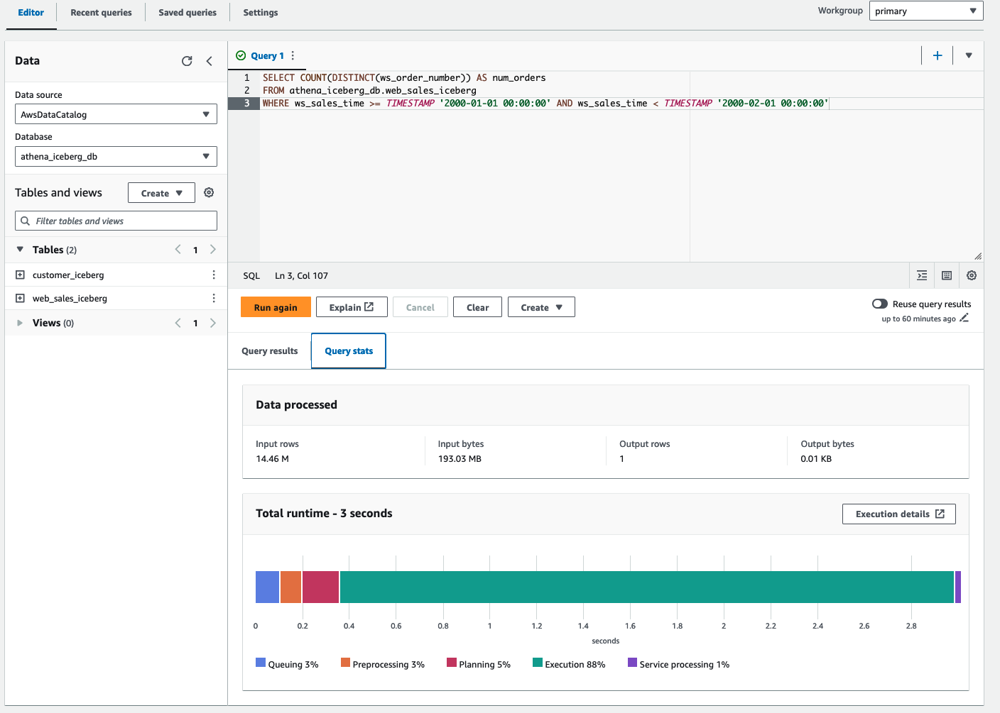
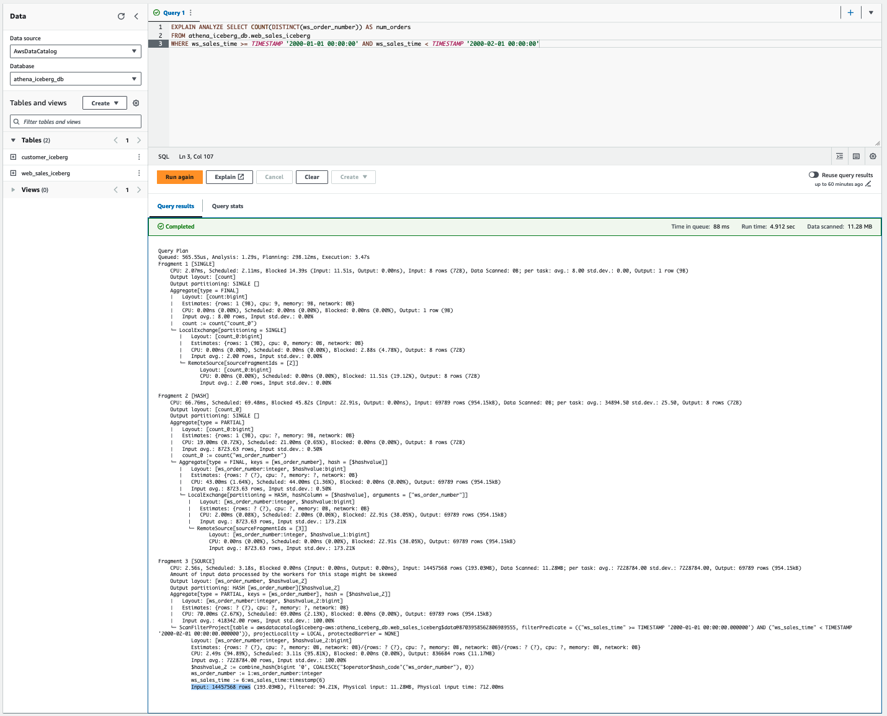
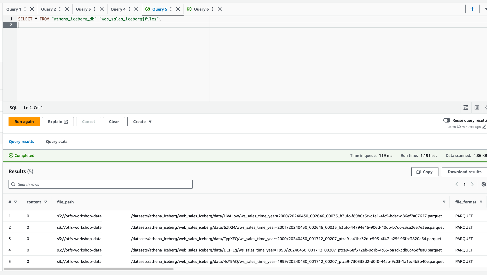
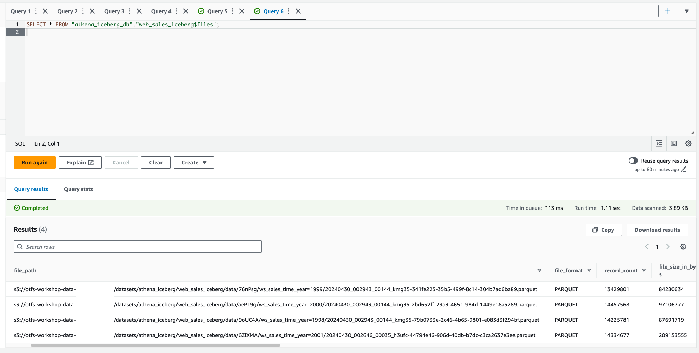

Neste laboratório, você explorará funcionalidades avançadas do Apache Iceberg.

Observe que o Amazon Athena fornece suporte integrado para o Apache Iceberg, para que você possa ler e gravar em tabelas Iceberg sem adicionar nenhuma dependência ou configuração adicional. Isso é válido para Iceberg [tabelas v2](https://iceberg.apache.org/spec/\#version\-2\-row\-level\-deletes) .


## Principais pontos de aprendizagem:

* Particionamento oculto Iceberg
* Como atualizar, excluir ou inserir linhas condicionalmente (mesclar) em tabelas Iceberg
* Otimizando tabelas Iceberg

---

## Particionamento Oculto

O ​​particionamento oculto do Iceberg é uma melhoria em relação à abordagem do Hive que torna o particionamento declarativo. Ao criar uma tabela, você pode configurar como particioná-la usando uma construção chamada especificação de partição, como `day(event_ts)`. Essas expressões dizem ao Iceberg como derivar valores de partição no momento da gravação. No momento da leitura, o Iceberg usa os relacionamentos para converter automaticamente filtros de dados em filtros de partição.


O volume inicial de dados de vendas não é tão grande, portanto, você escolhe particionar os dados por ano de vendas usando a expressão `years(ws_sales_time)`.

1. Crie a tabela Iceberg `web_sales_iceberg`. Copie a consulta abaixo no editor de consultas, substitua `<your-account-id>` pelo ID da conta atual e clique em **Executar** .

``` sql
CREATE TABLE athena_iceberg_db.web_sales_iceberg (
    ws_order_number INT,
    ws_item_sk INT,
    ws_quantity INT,
    ws_sales_price DOUBLE,
    ws_warehouse_sk INT,
    ws_sales_time TIMESTAMP)
PARTITIONED BY (year(ws_sales_time))
LOCATION 's3://otfs-workshop-data-<your-account-id>/datasets/athena_iceberg/web_sales_iceberg'
TBLPROPERTIES (
  'table_type'='iceberg',
  'format'='PARQUET',
  'write_compression'='ZSTD'
);
```

A consulta deverá ser executada com sucesso e você verá a mensagem "Consulta bem-sucedida" nos resultados da consulta.


2. Primeiro insira todos os registros de vendas antes do ano 2001\. Copie a consulta abaixo no editor de consultas e clique em **Executar**


``` sql
INSERT INTO athena_iceberg_db.web_sales_iceberg
SELECT * FROM tpcds.prepared_web_sales where year(ws_sales_time) < 2001; 
```

A consulta deve ser executada sem nenhum erro.

3. Verifique se os dados foram inseridos

``` sql
SELECT *
FROM athena_iceberg_db.web_sales_iceberg
LIMIT 10;
```

4. Vamos consultar os arquivos de dados para validar se a tabela está particionada por ano


``` sql
SELECT * FROM "athena_iceberg_db"."web_sales_iceberg$files"
```


You can confirm hidden partitioning is used at query time by running the following query

``` sql
SELECT COUNT(DISTINCT(ws_order_number)) AS num_orders
FROM athena_iceberg_db.web_sales_iceberg
WHERE ws_sales_time >= TIMESTAMP '2000-01-01 00:00:00' AND ws_sales_time < TIMESTAMP '2000-02-01 00:00:00'
```

Ao verificar as estatísticas da consulta, você pode ver que as **Linhas de entrada** são `14,46 milhões`.



Essa é exatamente a quantidade de registros para a partição do ano 2000, o que demonstra que a remoção da partição foi realizada corretamente e, portanto, apenas os registros da partição 2000 são inspecionados:

``` sql
SELECT YEAR(ws_sales_time) as year, COUNT(*) AS records_per_year
FROM athena_iceberg_db.web_sales_iceberg
GROUP BY YEAR(ws_sales_time)
```


Você pode ver o número de linhas de entrada específicas para a consulta com a instrução [EXPLAIN ANALYZE](https://docs.aws.amazon.com/athena/latest/ug/athena-explain-statement.html):

``` sql
EXPLAIN ANALYZE SELECT COUNT(DISTINCT(ws_order_number)) AS num_orders
FROM athena_iceberg_db.web_sales_iceberg
WHERE ws_sales_time >= TIMESTAMP '2000-01-01 00:00:00' AND ws_sales_time < TIMESTAMP '2000-02-01 00:00:00'
```



O particionamento oculto traz os seguintes benefícios:

* O Iceberg lida com a tarefa propensa a erros de produzir valores de partição para linhas em uma tabela.
* O Iceberg evita a leitura automática de partições desnecessárias. Os consumidores não precisam saber como a tabela é particionada e adicionar filtros extras às suas consultas.

---

## Atualizar, excluir ou inserir linhas condicionalmente em uma tabela Apache Iceberg

Nesta seção, você aprenderá como atualizar, excluir ou inserir linhas condicionalmente em uma tabela do Apache Iceberg. [MERGE INTO](https://docs.aws.amazon.com/athena/latest/ug/merge-into-statement.html) é uma única instrução que pode combinar ações de atualização, exclusão e inserção.

Observação: [MERGE INTO](https://docs.aws.amazon.com/athena/latest/ug/merge-into-statement.html) é transacional e tem suporte apenas para tabelas Apache Iceberg no mecanismo Athena versão 3.

Você criará a tabela `merge_table` e a usará para mesclar registros na tabela de destino `athena_iceberg_db.web_sales_iceberg`.


1. Agora crie a tabela de mesclagem Iceberg: `merge_table`. Para criar a tabela, copie a consulta abaixo no editor de consultas, substitua `<your-account-id>` pelo ID da conta atual e clique em **Executar** .

``` sql
CREATE TABLE athena_iceberg_db.merge_table (
    ws_order_number INT,
    ws_item_sk INT,
    ws_quantity INT,
    ws_sales_price DOUBLE,
    ws_warehouse_sk INT,
    ws_sales_time TIMESTAMP,
    operation string)
PARTITIONED BY (year(ws_sales_time))
LOCATION 's3://otfs-workshop-data-<your-account-id>/datasets/athena_iceberg/merge_table'
TBLPROPERTIES (
  'table_type'='iceberg',
  'format'='PARQUET',
  'write_compression'='ZSTD'
);
```

---

6. Você tem a coluna `operation` na `merge_table`. Agora você adiciona registros dentro desta tabela e adiciona o valor da coluna `operation = 'U'` para identificar os registros a serem atualizados, `operation = 'I'` para identificar os registros a serem inseridos e `operation = 'D'` para identificar os registros a serem excluídos.

   1. Insira linhas em `merge_table` com o sinalizador `operation = 'U'`. Copie a consulta abaixo no editor e clique em **Executar**

  ``` sql
  INSERT INTO athena_iceberg_db.merge_table
  SELECT ws_order_number, ws_item_sk, ws_quantity, ws_sales_price, 16 AS ws_warehouse_sk, ws_sales_time, 'U' as operation  
  FROM tpcds.prepared_web_sales where year(ws_sales_time) = 2000 AND ws_warehouse_sk = 10 
  ```

  Esta consulta atualiza todas as transações de vendas do armazém 10 no ano 2000 para o armazém 16.

   2. Insira linhas em `merge_table` com o sinalizador `operation = 'I'`. Copie a consulta abaixo no editor e clique em **Executar**


  ``` sql
  INSERT INTO athena_iceberg_db.merge_table
  SELECT ws_order_number, ws_item_sk, ws_quantity, ws_sales_price, ws_warehouse_sk, ws_sales_time, 'I' as operation
  FROM tpcds.prepared_web_sales where year(ws_sales_time) = 2001
  ```

  Esta consulta representa inserções de transações de vendas no ano 2001.


  3. Insira linhas em `merge_table` com o sinalizador `operation = 'D'`. Copie a consulta abaixo no editor e clique em **Executar**

  ``` sql
  INSERT INTO athena_iceberg_db.merge_table
  SELECT ws_order_number, ws_item_sk, ws_quantity, ws_sales_price, ws_warehouse_sk, ws_sales_time, 'D' as operation  
  FROM tpcds.prepared_web_sales where year(ws_sales_time) = 1999 AND ws_warehouse_sk = 9
  ```

  Esta consulta descarta todas as transações de vendas do depósito 9 no ano de 1999.

---

7. Consulte a tabela `athena_iceberg_db.merge_table` e verifique se os registros estão sendo exibidos para `operation = 'U'`, `operation = 'I'` e `operation = 'D'`.

``` sql
select operation, count(*) as num_records
from athena_iceberg_db.merge_table
group by operation
```

---

8. Você aplica todas as alterações contidas dentro da `merge_table` na tabela `web_sales_iceberg` usando o comando `MERGE`. Copie a consulta abaixo no editor e clique em **Executar**

``` sql
MERGE INTO athena_iceberg_db.web_sales_iceberg t
USING athena_iceberg_db.merge_table s
    ON t.ws_order_number = s.ws_order_number AND t.ws_item_sk = s.ws_item_sk
WHEN MATCHED AND s.operation like 'D' THEN DELETE
WHEN MATCHED AND s.operation like 'U' THEN UPDATE SET ws_order_number = s.ws_order_number, ws_item_sk = s.ws_item_sk, ws_quantity = s.ws_quantity, ws_sales_price = s.ws_sales_price, ws_warehouse_sk = s.ws_warehouse_sk, ws_sales_time = s.ws_sales_time
WHEN NOT MATCHED THEN INSERT (ws_order_number, ws_item_sk, ws_quantity, ws_sales_price, ws_warehouse_sk, ws_sales_time) VALUES (s.ws_order_number, s.ws_item_sk, s.ws_quantity, s.ws_sales_price, s.ws_warehouse_sk, s.ws_sales_time)
```

---

9. Consulte a tabela para confirmar se a operação de mesclagem funcionou corretamente.

* Agora você pode validar se tem dados para o ano de 2001 (as inserções estão aplicadas corretamente)

``` sql
SELECT YEAR(ws_sales_time) AS year, COUNT(*) as records_per_year
FROM athena_iceberg_db.web_sales_iceberg
GROUP BY (YEAR(ws_sales_time))
ORDER BY year
```

* Você pode validar que não há nenhuma entrada com ID de depósito definida como 10 para o ano 2000 e, em vez disso, você tem entradas com ID de depósito definida como 16 (as atualizações são aplicadas corretamente)

``` sql
SELECT ws_warehouse_sk, COUNT(*) as records_per_warehouse
FROM athena_iceberg_db.web_sales_iceberg
WHERE YEAR(ws_sales_time) = 2000
GROUP BY ws_warehouse_sk
ORDER BY ws_warehouse_sk
```

* Você pode validar na tabela que não há nenhuma entrada com ID de depósito definido como 9 para o ano de 1999 (as exclusões são aplicadas corretamente)

``` sql
SELECT ws_warehouse_sk, COUNT(*) as records_per_warehouse
FROM athena_iceberg_db.web_sales_iceberg
WHERE YEAR(ws_sales_time) = 1999
GROUP BY ws_warehouse_sk
ORDER BY ws_warehouse_sk
```

Você pode consultar a tabela `snapshots` e ver um novo snapshot com o valor `operation` como `overwrite`

---

## Optimizing Iceberg tables

À medida que os dados se acumulam em uma tabela Iceberg, as consultas gradualmente se tornam menos eficientes devido ao aumento do tempo de processamento necessário para abrir arquivos. Custo computacional adicional é incorrido se a tabela contiver arquivos de exclusão. No Iceberg, os arquivos de exclusão armazenam exclusões de nível de linha, e o mecanismo deve aplicar as linhas excluídas aos resultados da consulta. Para ajudar a otimizar o desempenho das consultas em tabelas Iceberg, o Athena oferece suporte à compactação manual como um comando de manutenção de tabela. As compactações otimizam o layout estrutural da tabela sem alterar o conteúdo da tabela. Para fazer isso, você pode usar a consulta [OPTIMIZE](https://docs.aws.amazon.com/athena/latest/ug/optimize-statement.html) do Athena que faz o seguinte:

* compactar arquivos pequenos em maiores (reduzir a quantidade de arquivos a serem abertos durante a leitura)
* mesclar arquivos de exclusão de posição com arquivos de dados (evitar ter que aplicar exclusões de posição ao consultar)

1.  Observe os arquivos de dados do iceberg da tabela antes de começar a otimizá-la.

``` sql
SELECT * FROM "athena_iceberg_db"."web_sales_iceberg$files";
```



Observe o nome do arquivo e a contagem de registros para cada partição

11. Você OTIMIZARÁ a tabela inteira. Copie a consulta abaixo no editor de consultas e clique em **Executar**

``` sql
OPTIMIZE athena_iceberg_db.web_sales_iceberg REWRITE DATA USING BIN_PACK;
```

Os resultados da consulta devem conter a mensagem "Consulta bem-sucedida".

12. Agora execute novamente o comando para listar os arquivos da Tabela Iceberg.

``` sql
SELECT * FROM "athena_iceberg_db"."web_sales_iceberg$files";
```



Compare as capturas de tela da etapa 10 e da etapa 12. Observe que o número total de arquivos mudou de 5 para 4 arquivos.

Com o comando `OPTIMIZE` isso aconteceu:

* Partição `ws_sales_time_year=1998`: os arquivos permanecem inalterados, pois você não altera a partição.
* Partição `ws_sales_time_year=1999`: a contagem de registros é reduzida porque o comando `Merge` exclui registros (etapa 6\.3\).
* Partição `ws_sales_time_year=2000`: compacta 2 arquivos em um porque o comando `Merge` atualizou os registros (etapa 6\.1\). Os arquivos de dados são mesclados com os arquivos de exclusão de posição.
* Partições `ws_sales_time_year=2001`: os arquivos permanecem inalterados, pois você insere apenas registros dentro da partição

Você pode consultar a tabela `snapshots` e verá um novo snapshot com o valor `operation` como `replace`

``` sql
SELECT * FROM "athena_iceberg_db"."web_sales_iceberg$snapshots";
```

Outra opção: você também pode OTIMIZAR apenas partições específicas, por exemplo 'ws\_sales\_time\_year\=2000' como segue.

``` sql
OPTIMIZE athena_iceberg_db.web_sales_iceberg REWRITE DATA USING BIN_PACK
where year(ws_sales_time) = 2000
```

Para controlar o tamanho dos arquivos a serem selecionados para compactação e o tamanho do arquivo resultante após a compactação, você pode usar parâmetros de propriedade de tabela. Você pode usar o comando [ALTER TABLE SET PROPERTIES](https://docs.aws.amazon.com/athena/latest/ug/querying-iceberg-managing-tables.html#querying-iceberg-alter-table-set-properties) para configurar as [propriedades de tabela](https://docs.aws.amazon.com/athena/latest/ug/querying-iceberg-creating-tables.html#querying-iceberg-table-properties) relacionadas.

Você pode especificar essas propriedades de tabela ao criar uma tabela. Exemplo:

``` sql
CREATE TABLE athena_iceberg_db.web_sales_iceberg (
ws_order_number INT,
ws_item_sk INT,
ws_quantity INT,
ws_sales_price DOUBLE,
ws_warehouse_sk INT,
ws_sales_time TIMESTAMP)
PARTITIONED BY (year(ws_sales_time))
LOCATION 's3://otfs-workshop-data-<your-account-id>/datasets/athena_iceberg/web_sales_iceberg'
TBLPROPERTIES (
'table_type'='iceberg',
'format'='PARQUET',
'write_compression'='ZSTD',
'write_target_data_file_size_bytes'='346870912',
'optimize_rewrite_delete_file_threshold'='16',
'optimize_rewrite_data_file_threshold'='16'
);
```

bem como posteriormente usando a instrução `ALTER TABLE`. Exemplo:

``` sql
ALTER TABLE athena_iceberg_db.web_sales_iceberg SET TBLPROPERTIES (
'write_target_data_file_size_bytes'='346870912',
'optimize_rewrite_delete_file_threshold'='16',
'optimize_rewrite_data_file_threshold'='16'
)
```