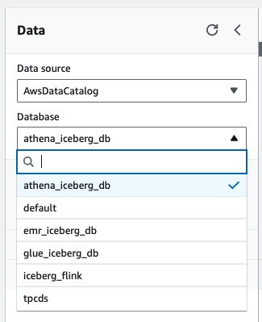

# Laboratório: Consultando Tabelas Iceberg com Amazon Athena

## Introdução

Neste laboratório, você explorará como usar o Amazon Athena para consultar tabelas Iceberg de forma eficiente, aplicando técnicas de análise de performance e otimização de consultas.

### Objetivos de Aprendizagem

Ao final deste laboratório, você será capaz de:
- Executar consultas SQL eficientes em tabelas Iceberg
- Criar e utilizar views para simplificar consultas complexas
- Analisar planos de execução com EXPLAIN e EXPLAIN ANALYZE
- Interpretar métricas de performance e identificar oportunidades de otimização
- Aplicar melhores práticas para consultas em ambientes de produção

### Pré-requisitos

- Conclusão dos laboratórios anteriores (Funcionalidades Básicas e Avançadas)
- Tabelas Iceberg criadas nos laboratórios Glue, EMR ou Athena
- Conhecimento básico de análise de performance de consultas SQL

**Contexto:** O Amazon Athena fornece suporte integrado para o Apache Iceberg, permitindo ler e gravar em tabelas Iceberg sem dependências ou configurações adicionais. Isso é válido para Iceberg [tabelas v2](https://iceberg.apache.org/spec/#version-2-row-level-deletes).

Para mais informações, consulte a documentação oficial do [Amazon Athena](https://docs.aws.amazon.com/athena/latest/ug/what-is.html) e do [Apache Iceberg](https://iceberg.apache.org/).

Observe que o Amazon Athena fornece suporte integrado para o Apache Iceberg, para que você possa ler e gravar em tabelas Iceberg sem adicionar nenhuma dependência ou configuração adicional. Isso é válido para Iceberg [tabelas v2](https://iceberg.apache.org/spec/#version-2-row-level-deletes).

## Principais pontos de aprendizagem

- **Consultas SQL otimizadas**: Como consultar tabelas Iceberg usando Amazon Athena
- **Views e abstrações**: Como criar visualizações com tabelas Iceberg
- **Análise de performance**: Como analisar planos de execução e desempenho de consultas com EXPLAIN e EXPLAIN ANALYZE
- **Interpretação de resultados**: Compreender métricas de performance e boas práticas para otimização

> **Importante**: Você consultará as tabelas `web_sales_iceberg` e `customer_iceberg` criadas nos laboratórios Glue, EMR ou Athena. Certifique-se de que essas tabelas estão disponíveis antes de prosseguir.

## Consultar tabelas Iceberg

### Seleção de Database

**Importante**: Esta seção pode ser usada para consultar qualquer uma das tabelas criadas como parte dos laboratórios anteriores.

**Configuração do ambiente**:
- Se você criou tabelas `web_sales_iceberg` e `customer_iceberg` como parte dos laboratórios **Glue**, certifique-se de selecionar o banco de dados `glue_iceberg_db` no painel esquerdo do editor antes de executar as consultas
- Da mesma forma, selecione `emr_iceberg_db` se você criou tabelas como parte dos laboratórios **EMR** 
- Ou `athena_iceberg_db` se você criou tabelas como parte dos laboratórios **Athena**

**Dica**: A seleção correta do database é fundamental para que as consultas funcionem adequadamente. Verifique sempre qual database está selecionado antes de executar comandos SQL.



1. Para consultar um conjunto de dados Iceberg, use uma instrução SELECT padrão como a seguinte.

**Características das consultas Iceberg**:
- **Sintaxe SQL padrão**: Não requer comandos especiais
- **Otimização automática**: Iceberg otimiza automaticamente a leitura baseada em filtros
- **Partition pruning**: Elimina partições desnecessárias automaticamente
- **Predicate pushdown**: Aplica filtros no nível de arquivo para melhor performance

**Exemplo prático**: A consulta abaixo demonstra uma agregação típica com filtros que se beneficiam das otimizações do Iceberg.

``` sql
SELECT ws_warehouse_sk, count(distinct(ws_order_number)) as num_orders
FROM web_sales_iceberg
WHERE ws_warehouse_sk in (5,6,10,11)
GROUP BY ws_warehouse_sk
```

Observação: as consultas seguem o Apache Iceberg [especificação de formato v2](https://iceberg.apache.org/spec/#format-versioning). Caso a consulta seja executada em uma tabela que usou `merge-on-read` (por exemplo, tabelas dentro de `athena_iceberg_db`), os arquivos de exclusão de posição são mesclados com os arquivos de dados imediatamente.

**Processamento de Delete Files**: Quando uma tabela contém arquivos de exclusão (resultado de operações UPDATE/DELETE), o Athena automaticamente:
- Identifica quais arquivos de dados são afetados
- Aplica as exclusões durante a leitura
- Retorna apenas os registros válidos
- Mantém a consistência ACID

Para mais detalhes sobre o processamento de consultas, consulte a [documentação de consultas Iceberg](https://docs.aws.amazon.com/athena/latest/ug/querying-iceberg-table-data.html).

2. Vamos verificar a quantidade de registros presentes em nossa tabela.

**Operações de contagem**: Esta consulta demonstra como o Iceberg otimiza operações de agregação usando estatísticas de metadados quando possível.

``` sql
SELECT count(*)
FROM customer_iceberg
```

3. Usando [EXPLAIN e EXPLAIN ANALYZE](https://docs.aws.amazon.com/athena/latest/ug/athena-explain-statement.html) no Athena

### Análise de Performance de Consultas

As instruções EXPLAIN e EXPLAIN ANALYZE são ferramentas fundamentais para compreender e otimizar o desempenho de consultas em tabelas Iceberg.

**Diferenças entre EXPLAIN e EXPLAIN ANALYZE**:

| Aspecto | EXPLAIN | EXPLAIN ANALYZE |
|---------|---------|-----------------|
| **Execução** | Não executa a consulta | Executa a consulta completa |
| **Informações** | Plano de execução estimado | Estatísticas reais de execução |
| **Uso** | Análise prévia, validação | Debugging de performance |
| **Custo** | Sem custo de processamento | Consome recursos como consulta normal |

**Métricas importantes para interpretar**:
- **Input rows**: Número de linhas lidas dos arquivos
- **Output rows**: Número de linhas retornadas
- **CPU time**: Tempo de processamento
- **Wall time**: Tempo total decorrido
- **Data scanned**: Volume de dados processados

Para guia completo sobre interpretação, consulte a [documentação de resultados EXPLAIN](https://docs.aws.amazon.com/athena/latest/ug/athena-explain-statement-understanding.html).

4. A instrução EXPLAIN mostra o plano de execução lógico ou distribuído de uma instrução SQL especificada, ou valida a instrução SQL. Você pode gerar os resultados em formato de texto ou em um formato de dados para renderizar em um gráfico.

    ``` sql
    EXPLAIN SELECT count(*) FROM customer_iceberg LIMIT 10;
    ```

5. A instrução EXPLAIN ANALYZE mostra tanto o plano de execução distribuído de uma instrução SQL especificada quanto o custo computacional de cada operação em uma consulta SQL. Você pode gerar os resultados em formato de texto ou JSON.

**Interpretação dos resultados EXPLAIN ANALYZE**:
- **Partition pruning**: Verifique se apenas as partições necessárias foram acessadas
- **File pruning**: Confirme se o número de arquivos lidos é otimizado
- **Join efficiency**: Analise a ordem e método de joins
- **Aggregation performance**: Observe se agregações são pushdown quando possível

**Dicas de otimização baseadas nos resultados**:
- Se muitas partições são lidas desnecessariamente, revise os filtros de partição
- Se muitos arquivos pequenos são processados, considere compactação
- Se joins são ineficientes, analise estatísticas e distribuição de dados

    ``` sql
    EXPLAIN ANALYZE
    SELECT ws_warehouse_sk, count(distinct(ws_order_number)) as num_orders
    FROM web_sales_iceberg
    WHERE ws_warehouse_sk in (5,6,10,11)
    GROUP BY ws_warehouse_sk
    ```

Consulte os [resultados da instrução EXPLAIN do Athena](https://docs.aws.amazon.com/athena/latest/ug/athena-explain-statement-understanding.html) para obter mais detalhes.

## Criando e consultando visualizações com tabelas Iceberg

### Views - Abstraindo Complexidade

As views (visualizações) são uma ferramenta poderosa para simplificar consultas complexas e criar abstrações reutilizáveis sobre tabelas Iceberg.

**Vantagens das views**:
- **Simplificação**: Encapsulam lógica complexa em interfaces simples
- **Reutilização**: Evitam duplicação de código SQL
- **Segurança**: Podem restringir acesso a colunas específicas
- **Manutenibilidade**: Centralizam mudanças de lógica de negócio
- **Performance**: Podem incluir otimizações pré-definidas

**Casos de uso comuns**:
- Agregações frequentemente utilizadas
- Joins complexos entre múltiplas tabelas
- Transformações de dados padronizadas
- Filtros de segurança e compliance
- Métricas de negócio calculadas

**Importante**: Views no Athena são armazenadas no AWS Glue Data Catalog e podem ser compartilhadas entre diferentes ferramentas de análise.

Para mais informações sobre views, consulte a [documentação de views do Athena](https://docs.aws.amazon.com/athena/latest/ug/views.html).

6. Para criar e consultar visualizações do Athena em tabelas Iceberg, use a instrução CREATE VIEW. Copie a consulta abaixo no editor de consultas e clique em **Executar**.

``` sql
CREATE VIEW total_orders_by_warehouse
AS
SELECT ws_warehouse_sk, count(distinct(ws_order_number)) as num_orders
FROM web_sales_iceberg
WHERE ws_warehouse_sk in (5,6,10,11)
GROUP BY ws_warehouse_sk
```

A consulta deverá ser executada com sucesso e você verá a mensagem "Consulta bem-sucedida" nos resultados da consulta.

7. Para consultar a exibição, copie a consulta abaixo no editor de consultas e clique em **Executar**.

**Benefícios da view criada**:
- **Abstração**: Usuários não precisam conhecer a estrutura da tabela subjacente
- **Consistência**: Garante que a mesma lógica de agregação seja sempre aplicada
- **Performance**: O Athena pode otimizar a view junto com outras consultas
- **Manutenção**: Mudanças na lógica podem ser feitas apenas na definição da view

**Conclusão do laboratório**: Parabéns! Você completou com sucesso o laboratório de consultas em tabelas Iceberg. Você aprendeu sobre:

- Execução de consultas SQL otimizadas em tabelas Iceberg
- Análise de performance com EXPLAIN e EXPLAIN ANALYZE
- Criação e utilização de views para abstrair complexidade
- Interpretação de métricas de performance
- Melhores práticas para consultas em produção

**Próximos passos**: Estes conhecimentos preparam você para trabalhar eficientemente com tabelas Iceberg em ambientes de produção, aplicando técnicas de otimização e monitoramento de performance.

**Recursos adicionais**:
- [Guia de otimização de consultas Athena](https://docs.aws.amazon.com/athena/latest/ug/optimization.html)
- [Melhores práticas para Iceberg](https://docs.aws.amazon.com/prescriptive-guidance/latest/apache-iceberg-on-aws/best-practices.html)
- [Monitoramento de performance no Athena](https://docs.aws.amazon.com/athena/latest/ug/workgroups-cloudwatch.html)

``` sql
SELECT *
FROM total_orders_by_warehouse
```